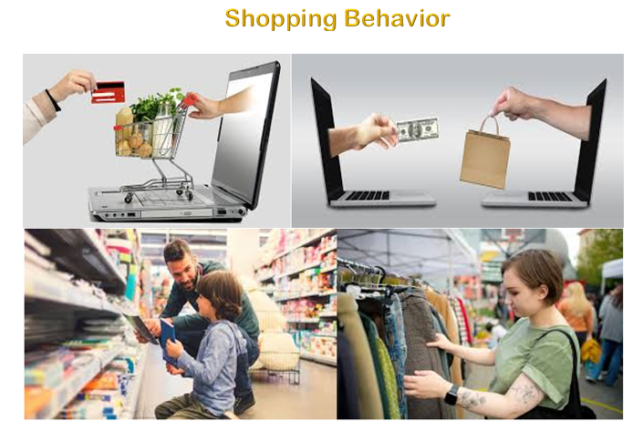
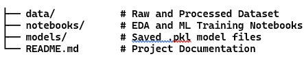
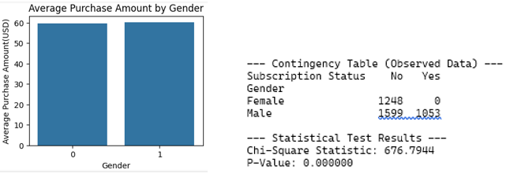
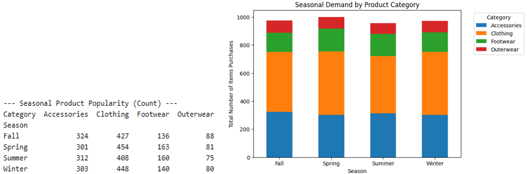
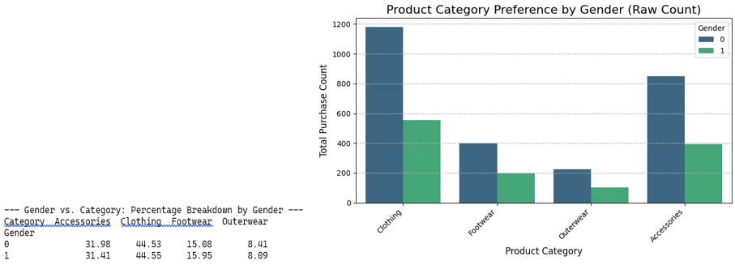
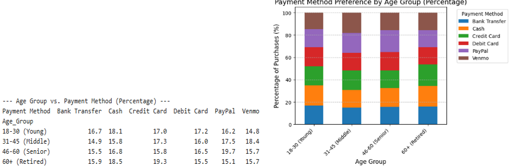
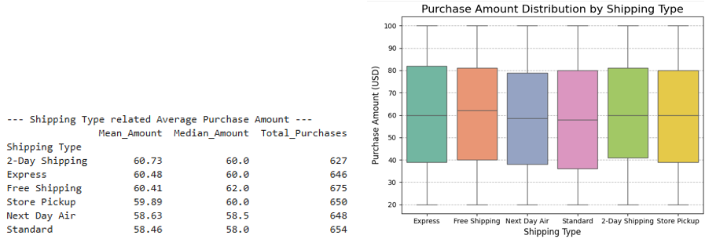
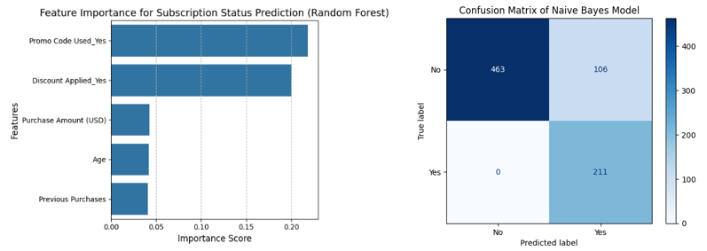
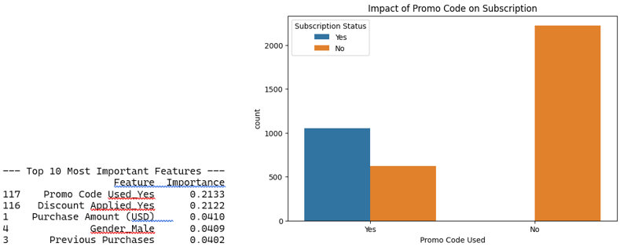
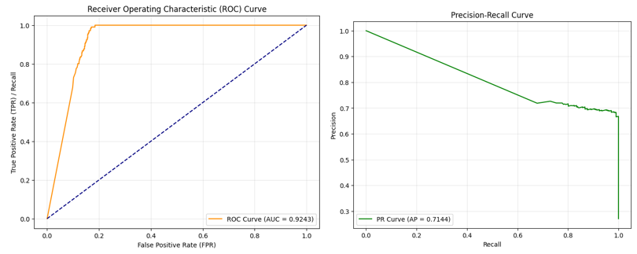

# Shopping Behavior


## **Objective: Customer Subscription Prediction (84% Accuracy) | End-to-End ML Pipeline for Targeted Marketing**

## Introduction: 
**"Behind every transaction, there is a human emotion and a repeating pattern." **
In this project, explores the psychology behind every purchase, using data to bridge the gap between human feelings and commercial actions. 
I analyzed [ https://www.kaggle.com/datasets/saadaliyaseen/shopping-behaviour-dataset/data ] to decode these habitual patterns—turning human actions into actionable business insights.

### **Business Problem Statement** 

-	_"E-commerce companies struggle with high marketing costs. This project predicts subscription likelihood to optimize promotional spending."_

### **Dataset Information**
-	**Source:** Kaggle dataset link [https://www.kaggle.com/datasets/zubairamuti/shopping-behaviours-dataset]
-	**Records:** 3900
-	**Features:** Age, Gender, Category, Shipping Type, Payment Method, Subscription Status, etc,… 
This project explores customer shopping habits using EDA and Machine Learning to uncover insights for business intelligence.

### **Folder Structure Section (Project structure)**


## **How to Run**
 pip install -r requirements.txt

## **Executive Summary**

### **Objective:** 
This project analyzes modern shopping behavior using Exploratory Data Analysis (EDA) and statistical methods to uncover customer habits, preferences, and actionable business insights. The dataset was sourced from Kaggle and includes demographic, transactional, and behavioral variables.

### Key Findings:
-	**Gender & Spending:** Average purchase amounts between male and female customers are nearly identical (~USD 60). Gender does not significantly influence spending behavior.
-	**Subscription Bias:** Statistical testing revealed a critical imbalance — 100% of subscribers are male, with zero female subscriptions. This suggests either a data quality issue or a marketing gap.
-	**Seasonal Demand:** Clothing consistently dominates across all seasons, while outerwear remains the least popular. Accessories show stable demand year round.
-	**Category Preferences:** Clothing accounts for ~45% of purchases across genders, making it the universal favorite. Women show slightly higher interest in footwear, while men lean toward outerwear.
-	**Age & Payment Methods:** 
* Seniors (46–60) surprisingly prefer PayPal (19.7%).
* Middle aged adults (31–45) favor Venmo (18.4%).
* Retired customers rely more on credit cards and cash.
- **Shipping Insights:** Customers choosing faster shipping (2 Day, Express) tend to spend more, while slower options (Standard, Next Day Air) correlate with lower spending. Free shipping still drives strong purchase amounts.
- **Demographic Highlight:** Middle aged men (31–45) are the most dominant segment, purchasing both clothing and accessories at high rates.

###  **Business Recommendations:**
1.	**Uniform Campaigns:** Promote clothing and accessories with general campaigns, as gender differences are minimal.
2.	**Targeted Promotions:** Focus on women’s footwear and middle aged men’s accessories for growth opportunities.
3.	**Payment Strategy:** Expand digital wallet partnerships (PayPal, Venmo) to capture middle aged and senior customers.
4.	**Shipping Incentives:** Leverage free shipping promotions to boost sales while maintaining profitability.
5.	**Subscription Strategy:** Investigate female subscription absence — redesign loyalty programs to attract female customers.

### **Project Architecture (Workflow Diagram)**
**LR
[Raw Data] --> [Data Cleaning]
 --> [EDA & Statistical Testing]
 --> [Feature Engineering]
 --> [Encoding & Scaling]
 --> [SMOTE Balancing]
 --> [Model Training]
 --> [Evaluation]
 --> [Prediction Pipeline]**

 ### **Limitations**
- Dataset contains gender imbalance.
- Female subscription records are absent.
- Results may not fully represent real-world customer behavior.
- Dataset size is relatively small for production-grade deployment.

### **Future Improvements**
- Deploy with Streamlit
- Add hyperparameter tuning
- Test advanced ensemble models
- Integrate real-time customer prediction

### **Conclusion:** 
Clothing remains the lifeblood of retail, while accessories present untapped potential. Middle aged men are the strongest buyer demographic, but subscription and female engagement require urgent attention. By aligning marketing, inventory, and loyalty programs with these insights, businesses can strengthen customer retention and drive sustainable growth.

## 🚀 How to Use

To explore or reproduce this analysis, follow these steps:

1. **Clone the Repository**:
   ```bash
   git clone [https://github.com/kyawsanoo5/git-journey.git](https://github.com/kyawsanoo5/git-journey.git)
2.	Prepare Environment:
Ensure you have Python installed. You can install the necessary libraries using:
Bash
pip install pandas numpy scikit-learn matplotlib seaborn
3.	Explore the Analysis:
o	Open the ShoppingBehavior.ipynb file in Jupyter Notebook or Google Colab.
o	The dataset is located in the data/ folder and is automatically loaded within the notebook.
4.	Run the Pipeline:
o	Execute the cells sequentially to see the EDA, Statistical Analysis, and Model Training process.
o	You can also test the saved .pkl model for real-time predictions.
5.	Modify and Explore:
Feel free to experiment with different hyperparameters or add more features to the dataset to see how it affects the model's Recall and Accuracy.

### 🛠️ Quick Access & Interactive Run

| Service | Access Link |
| :--- | :--- |
| **View Notebook** | [📂 Direct Link to Notebook](./Shopping_Behavior_End-to-End_Data_Analysis_MachineLearning_Project.ipynb) |
| **Interactive Run** | [](https://colab.research.google.com/github/kyawsanoo5/Shopping_Behavior_End-to-End_Data_Analysis_MachineLearning_Project/blob/main/Shopping_Behavior_End-to-End_Data_Analysis_MachineLearning_Project.ipynb) |
| **Live Environment** | [](https://mybinder.org/v2/gh/kyawsanoo5/Shopping_Behavior_End-to-End_Data_Analysis_MachineLearning_Project /HEAD) |
| **Static View** | [🌐 Open in nbviewer](https://nbviewer.org/github/kyawsanoo5/Shopping_Behavior_End-to-End_Data_Analysis_MachineLearning_Project /blob/main/Shopping_Behavior_End-to-End_Data_Analysis_MachineLearning_Project.ipynb) |

## 👤 Author - Kyawsanoo

This project is part of my portfolio, showcasing my expertise in **Python, Pandas, NumPy, Scikit-learn,** and **Statistical Modeling**—core skills essential for Data Analyst or Data Science Intern roles.

By utilizing this model, a retail business can strategically focus marketing efforts on high-probability leads, significantly reducing customer acquisition costs by filtering out non-likely subscribers.

### 🤝 Connect with Me
I am passionate about SQL, Data Analysis, and Data Science. Let's connect and discuss more about data-related topics!

* **LinkedIn**: [Kyawsanoo - Connect with me professionally](https://www.linkedin.com/in/kyaw-sanoo-425009396)

Thank you for your support, and I look forward to connecting with you!

##### **Loading Dependencies**
```python
import numpy as np
import pandas as pd
import seaborn as sns
import matplotlib.pyplot as plt```

##### **Loading Dataset and viewing data information including null values**

```python 
dataset=pd.read_csv("C:/Users/KseO/Desktop/ML/shopping_behavior_updated.csv")
```
##### **Loading Dataset and viewing data information including null values**

```python 
dataset=pd.read_csv("C:/Users/KseO/Desktop/ML/shopping_behavior_updated.csv")
```

##### **Label encode the Gender column and viewing head** 

```python
dataset[‘Gender’] = dataset[‘Gender’].map({‘Male’:0, ‘Female’:1})
```

### **Gender & Spending** 
**"A Critical Gender Imbalance in Subscription"**


-	**Business Insight** → If Male vs Female customers spending is almost the same, the marketing strategy can be made as a general promotion rather than gender-based.
-	**Data Analysis** → We can see that gender factor has no effect on spending behavior.
-	**ML Feature Engineering** → We can decide whether to include gender as a predictor.

**1. Chi-Square Statistic → 676.7944**

**2. P-Value → 0.000000**
-	**P-Value < 0.05:**

-	**H0: Reject the Null Hypothesis**
-	**Ha: not reject** (There is a **significant correlation** between **gender** and **subscription**).

### Seasonal Category Popularity

```python
seasonal_pivot = seasonal_category_sales.pivot(index='Season', columns='Category', values='Total_Purchases').fillna(0)

seasonal_pivot.plot(kind='bar', stacked=True, figsize=(10, 6))
```


**➡ This chart shows Seasonal Product Popularity.**

**➡** The **Clothing** category is the product with the **highest demand** at the _end of the season._

**➡ Outerwear** is the product with the _least demand._

By going through these analysis steps in a systematic manner, you will be able to determine the best seasons to market your business.

### **Product Preference by Gender** 

```python 
gender_category_percent = pd.crosstab(df['Gender'], df['Category'], normalize='index') * 100

sns.countplot(data=df, x='Category', hue='Gender', palette='viridis')
```


**Storytelling Insight** 
-	**Clothing** accounts for nearly 45% of purchases across both genders.
-	**Accessories** show similarly strong demand among male and female customers.
-	**Women** show slightly higher interest in footwear.

### **Age Group vs. Payment Method**

```python
age_payment_crosstab = pd.crosstab(df['Age_Group'], df['Payment Method'], normalize='index') * 100

plot_data = age_payment_crosstab.copy()

plot_data.plot(kind='bar', stacked=True, figsize=(10, 6))
```


**The Insight (Payment Secrets That Age Tells)**

-	Seniors show unexpectedly strong PayPal usage.
-	Middle-aged customers prefer Venmo.
-	Retired customers rely more on traditional payment methods

### **Shipping Type vs. Spending**
```python
shipping_spending_stats = df.groupby('Shipping Type')['Purchase Amount (USD)'].agg(
    Mean_Amount='mean',
    Median_Amount='median',
    Total_Purchases='count'
).sort_values(by='Mean_Amount', ascending=False)

sns.boxplot(x='Shipping Type', y='Purchase Amount (USD)', data=df, palette='Set2')
```


**➡ Storytelling:**

-	Faster shipping (2-Day, Express) → Higher spending.
-	Slower shipping (Standard, Next Day Air) → Lower spending.
-	Free shipping → Still attracts good spending, showing promotions can encourage purchases.

Item Purchased, Category, Location, Size, and Season are key confounding factors that can help to explain the results. The reasons for including these variables and the patterns

### **Conclusion Recommendation (The Bottom Line)**

Notably, middle-aged adults (31-45 years old) are tech-savvy and increasingly use digital payments like PayPal and Venmo.
In addition, we believe that offering free shipping as a marketing promotion can increase sales, as buyers prioritize free shipping over fast delivery."

## **Shopping Behavior Machine Learning**

**Comparison of the main difference accuracy & scores between models**

| ** Model** | ** Accuracy** | ** Precision (Class 1)** | **Recall (Class 1)** | ** F1-Score (Class 1)** |
|----------------|--------------------|--------------------------------|----------------------------|--------------------------------|
| Logistic Regression | 0.8218 | 0.62 | 0.88 | 0.73 |
| Random Forest | 0.8205 | 0.63 | 0.91 | 0.74 | 
| ** GaussianNB** | **0.8390** | 0.62 | **0.99** | 0.76 |
| Linear SVM | 0.8305 | **0.67** | 0.93 | **0.78** |
| KNN | 0.7249 | 0.52 | 0.26 | 0.34 |

## ** 🤖 Why GaussianNB? – A Strategic Decision**

#### **Model Comparison**
We tested multiple models (Logistic Regression, Random Forest, SVM, KNN, Naive Bayes).  
Gaussian Naive Bayes emerged as the **champion model**.

#### **Key Advantage**
- **Recall (Yes Class): 99%** → Captures nearly all potential subscribers.
- **Accuracy: 83.9%** → Reliable overall predictions.
- **AUC-ROC: 0.92** → Strong discrimination between subscriber vs. non-subscriber.

#### **Business Impact**
- **No Missed Opportunities**: Ensures every potential subscriber is identified.
- **Revenue Predictability**: Higher subscription rates through recall-focused targeting.
- **Strategic Trade-off**: In this context, missing a subscriber (FN) is more costly than sending a promo to a non-subscriber (FP).

#### **Preprocessing** 

```python
#  Setting Target (y)
le = LabelEncoder()
y = le.fit_transform(dataset['Subscription Status'])
```

#### **Building Models "I solved the Class Imbalance using SMOTE."**
```python
nb_pipeline = imbPipeline([
    ('smote', SMOTE(random_state=42)),
    ('scaler', StandardScaler()), # Naive Bayes often requires good scaling
    ('classifier', GaussianNB())
])

nb_scores = cross_val_score(nb_pipeline, X, y, cv=cv)

Naive Bayes CV Accuracy: 0.8390

top_features = feature_importance_df.head(5)

sns.barplot(x='Importance', y='Feature', data=top_features)

nb_pipeline.fit(X_train, y_train)
y_pred_nb = nb_pipeline.predict(X_test)
```


**Storytelling Insight** 
-	**Promo Code + Discount →** Customers who use promotions have a major influence on subscription decisions.
-	**Demographics (Gender, Age) →** Subscription behavior is slightly affected.
-	**Behavioral features (Previous Purchases, Review Rating) →** Signals customer loyalty + satisfaction.
➡ "When the model predicts subscription status, promotions (promo code, discount) are the main factors. Demographics and behavioral features have a minor impact.""

#### **"Marketing Recommendation based on Data Insights"**

**Key Driving Factors for Subscription**
```python
feature_names = X_train.columns

importances = rf_model_importance.feature_importances_

feature_importance_df = feature_importance_df.sort_values(by='Importance', ascending=False)

sns.countplot(data=dataset, x='Promo Code Used', hue='Subscription Status')
```


*“Promotional incentives are the strongest lever for subscription growth, driving over 40% of customer decisions.”*

#### 📊 Marketing Recommendation based on Data Insights
### Key Drivers of Subscription
- **Promo Code Usage (21%)** and **Discounts (21%)** are the strongest predictors.
- Purchase Amount, Gender, and Previous Purchases also contribute steadily.
##### **Insight**
Customers using promo codes are significantly more likely to subscribe. 
While subscriptions are rare among customers without promotional incentives.
##### **Business Impact**
- Reliance on discounts risks long term sustainability.
- Strategic decision: balance between **losing potential buyers (FN)** vs. **overspending on promos (FP)**.
- Recommendation: explore loyalty programs and personalized offers to reduce promo dependency.

### **Model Evaluation**
```python
plt.plot(fpr, tpr, color='darkorange', label=f'ROC Curve (AUC = {auc_score:.4f})')
plt.plot([0, 1], [0, 1], color='navy', linestyle='--') # Slant (Random line)

ap_score = average_precision_score(y_test, y_probs)

precision, recall, _ = precision_recall_curve(y_test, y_probs)
```


"The **PR Curve (AP 0.71)** confirms that the model maintains high precision even while maximizing recall—a critical balance for targeted marketing efficiency."

#### **📈 Model Evaluation**

##### **Key Metrics**
- **ROC Curve (AUC = 0.92)** → Strong ability to discriminate between subscriber vs. non‑subscriber.
- **Precision-Recall Curve (AP = 0.71)** → Reliable performance on imbalanced data.
##### **Insights**
- If the model predicts a customer will subscribe, it is correct **71% of the time**.
- The model consistently identifies potential subscribers, even when the dataset is skewed.
##### **Business Impact**
- **High Reliability**: Strong confidence in subscriber predictions.
- **Strategic Trade-off**: Decide whether the bigger risk is losing potential buyers (FN) or overspending on promotions (FP).
- **Recommendation**: Use this model to target promo codes more efficiently, balancing acquisition cost with subscription growth.

### **Conclusion & Development**
```python
final_chain_model = imbPipeline([
    ('scaler', StandardScaler()),
    ('smote', SMOTE(random_state=42)),
    ('classifier', GaussianNB()) 
])

final_chain_model.fit(X, y)

joblib.dump(final_chain_model, "shopping_behavior_pipeline.pkl")
```
**"Predictions for New Customers"**
```python
predictions = loaded_pipeline.predict(new_data)

predicted_labels = le.inverse_transform(predictions)

>> Predictions for New Customers: ['No' 'No']
```
##### **Result Insight & The Storytelling** 
The model predicts these 2 new customers as "No" (those who cannot subscribe). What can we learn from this –
-	**Constraint Check:** This means that these customers are lacking strong features that would make them a good candidate for subscription 
-	**Model Confidence:** Since we used Naive Bayes, the answer 'No' is based on probability.

### **Project Conclusion**
1.	**The Objective:** Look at shopping behavior data to predict who will subscribe.
2.	**The Findings:** In the data, Chi-Square and Feature Importance found that using a promo code was the key to subscription.
3.	**The Best Model:** Comparing the four models (RF, NB, SVM, KNN), Naive Bayes was the best with an accuracy of 83.9% and a recall of 99%, which captured all subscribers without exception.
4.	**Final Value:** Using the pipeline we have now built, we can predict the behavior of new customers, which will help us reduce marketing costs and implement targeted promotions more effectively.

## **Author - Kyawsanoo5**
"Our analysis shows a strong correlation between promotional incentives and subscriptions. Customers who utilized a promo code were significantly more likely to subscribe. Conversely, subscriptions were nearly non-existent among customers without a promo code. This suggests that the company's current subscription growth is highly dependent on discount strategies."
- **LinkedIn**: [Connect with me professionally](www.linkedin.com/in/kyaw-sanoo-425009396)
